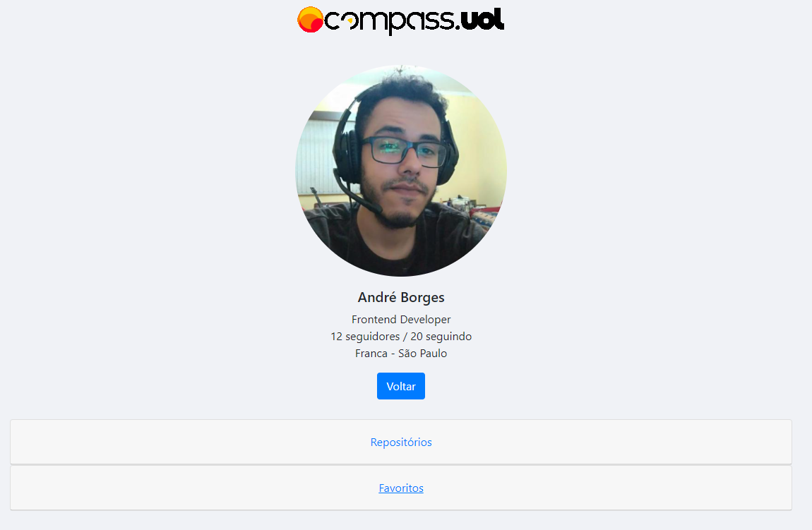

# Desafio Compass.uol

## Configuração

<br/>

- Para iniciar o servidor em desenvolvimento.

<br/>

1. Instale todas as dependências:

   ```sh
   $ yarn install
   ```

2. Rode o projeto:

   ```sh
   $ yarn start
   ```

3. Abra [http://localhost:3000](http://localhost:3000) em seu navegador.

<br/>

## Descrição do Projeto

O objetivo da aplicação é criar três componentes principais onde o usuário poderia buscar por usuários do GitHub, visualizar os resultados da busca e ter dois botões para executar determinado resultado. Os dados são obtidos através da API do GitHub.

<br/>
<p align="center">
  
<p>

## Ferramentas utilizadas

- React
- Axios
- React Router DOM
- Redux
- [Bootstrap 4.4](https://getbootstrap.com/docs/4.4/getting-started/introduction/)
